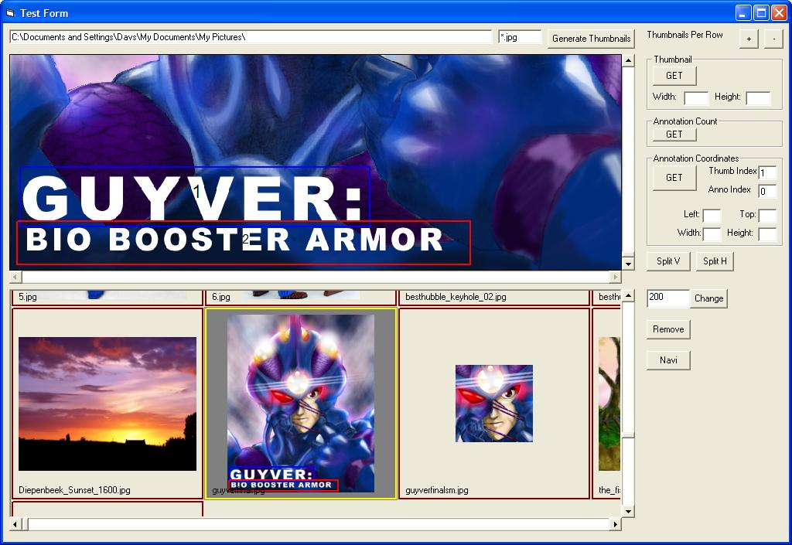

## FreeImageSuite

### Description

The free document image highlighting solution is back again! The original code has been revamped to be more object-oriented. The package now includes a thumbnail viewer and several classes and interfaces that you can use to implement your own annotation classes. The code is still in heavy beta stages, but useable enough for now. Includes a demo app to show you how to connect the image viewer to the thumbnail. Image/thumbnail annotation is kept in sync with a tricky Interface-Events workaround. This may change when multiple thumbnail highlights is implemented.
 
### More Info
 
As usual, requires FreeImage DLL from http://freeimage.sourceforge.net. File is available in the zip as "FreeImage.dl_". Remember to rename it.

             |
---                |---
**Submitted On**   |2007-07-09 06:24:44
**By**             |[David Santos](https://github.com/Planet-Source-Code/PSCIndex/blob/master/ByAuthor/david-santos.md)
**Level**          |Advanced
**User Rating**    |5.0 (15 globes from 3 users)
**Compatibility**  |VB 6\.0
**Category**       |[Custom Controls/ Forms/  Menus](https://github.com/Planet-Source-Code/PSCIndex/blob/master/ByCategory/custom-controls-forms-menus__1-4.md)
**World**          |[Visual Basic](https://github.com/Planet-Source-Code/PSCIndex/blob/master/ByWorld/visual-basic.md)
**Archive File**   |[FreeImageS207440782007\.zip](https://github.com/Planet-Source-Code/david-santos-freeimagesuite__1-63294/archive/master.zip)

